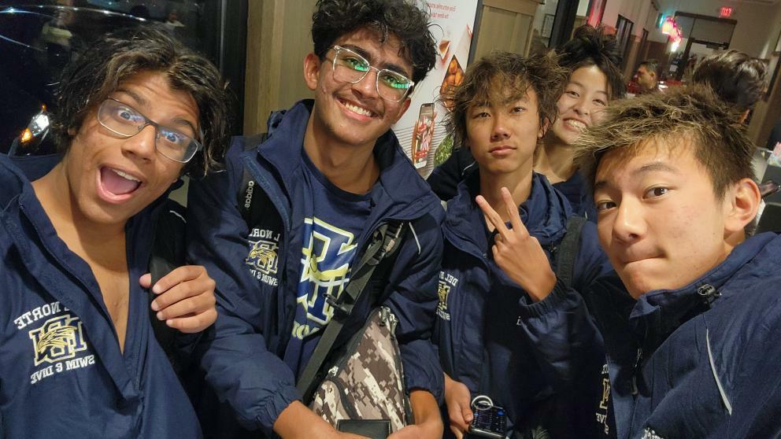
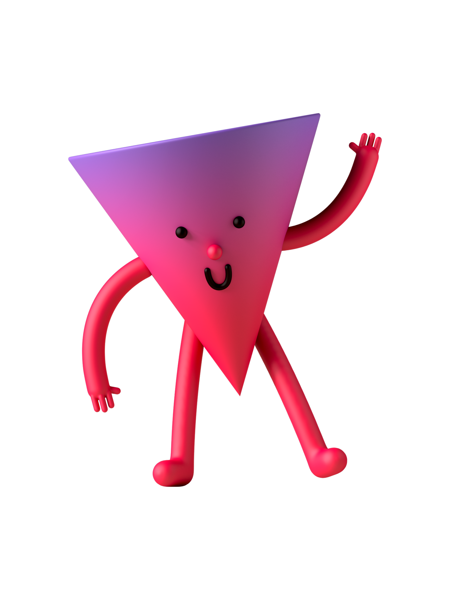

<html>
    <head>
        <meta charset="utf-8">
        <meta name="viewport" content="width=device-width, initial-scale=1">
        <link rel="stylesheet" href="customization.css">
        <link rel="stylesheet" href="https://maxcdn.bootstrapcdn.com/bootstrap/3.4.1/css/bootstrap.min.css">
        
        
    </head>

<body>
        <main>
          <article class="profile">
            <picture class="profile-img">
              <source srcset="" media="(min-width: 600px)">
              
            </picture>
            

              
Coding Profile

                <h1>Advay Shindikar</h1>
              

                Sophomore at Del Norte High School. I have been coding for 2 years. My favorite sports team is Bayern Munich.
              

              
            

          </article>
        </main>
</body> 
